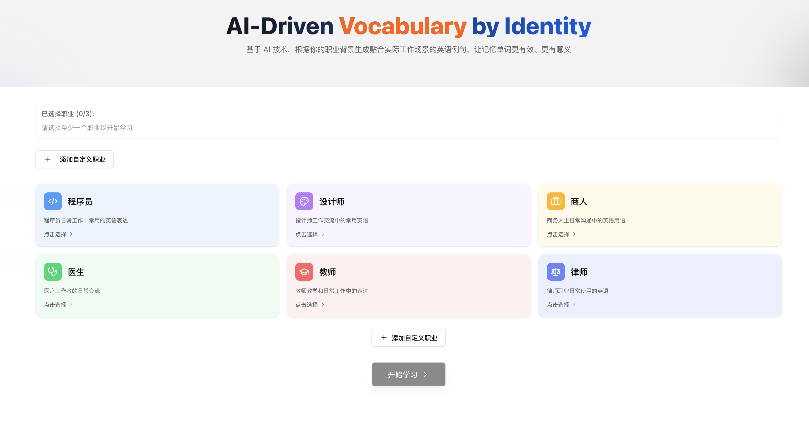
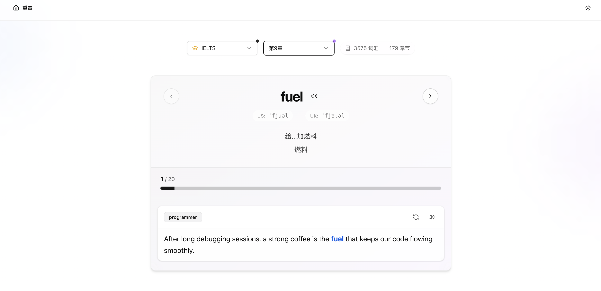

# AI Memo Words

  
  
  

🇨🇳 <a href="#chinese">中文</a> | 🇺🇸 <a href="#english">English</a>

## AI Memo Words - 智能场景化单词学习助手

将单词学习与职业场景完美结合，让每个例句都贴近您的工作实际。AI Memo Words 通过 AI 技术，为不同职业人群打造个性化的单词记忆体验，让枯燥的背单词变成提升职业技能的有趣过程。

🎯 **场景化记忆**
- 支持多个预设职业（程序员、设计师、医生等）
- 可自定义职业场景
- 同时选择多个职业身份，获得多维度例句

📚 **专业词库**
- 精选主流考试词汇（CET4/6、GRE、TOEFL、IELTS、考研）
- 按章节科学规划（每章 20 词）
- 系统化学习路径

🤖 **AI 智能助手**
- 为每个单词生成符合职业场景的例句
- 一键重新生成，直到满意为止
- 确保例句既准确又实用

💾 **学习助手**
- 自动记录学习进度
- 智能统计完成情况
- 随时继续上次学习

### 💻 技术栈

- **前端框架**: Next.js 14
- **UI 组件**: Tailwind CSS + Shadcn/ui
- **动画效果**: Framer Motion
- **AI 集成**: 集成先进大语言模型API
- **状态管理**: React Hooks
- **本地存储**: localStorage

### 📚 功能特点

#### 职业选择
- 预设职业类型（程序员、设计师、医生等）
- 支持自定义职业描述
- 可多选职业组合，获得多样化的例句

#### AI学习系统
- 丰富词库支持：
  - CET-4/6（大学英语四六级）
  - GRE（美国研究生入学考试）
  - TOEFL（托福考试）
  - IELTS（雅思考试）
  - PTE（培生英语考试）
  - 考研英语
- 按章节学习
- 自动保存进度
- AI智能例句生成
- 例句重生成功能

### 📸 应用截图

  
  
<em>主界面 - 职业背景选择</em>

  
  
  
<em>单词学习 - AI生成的专业例句</em>

  
  
  
<em>进度追踪 - 章节完成统计</em>

#### 界面功能
- 深色模式支持
- 响应式设计
- 流畅的过渡动画
- 直观的进度展示

### 💯 使用流程

1. 选择职业身份
2. 选择词库类型：
   - CET-4/6（大学英语四六级）
   - GRE（美国研究生入学考试）
   - TOEFL（托福考试）
   - IELTS（雅思考试）
   - PTE（培生英语考试）
   - 考研英语
3. 选择学习章节
4. 开始学习单词
5. 查看AI生成的职业相关例句
6. 不满意可一键重新生成例句

## 📜 License

MIT License

## Star History

